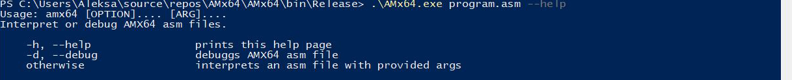
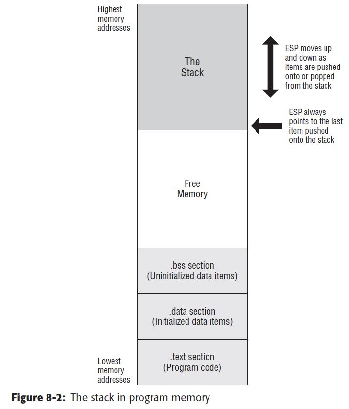
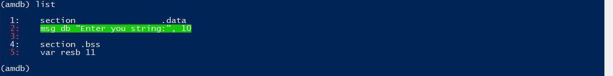
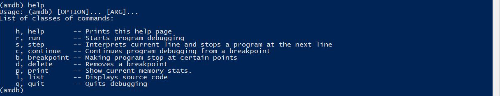
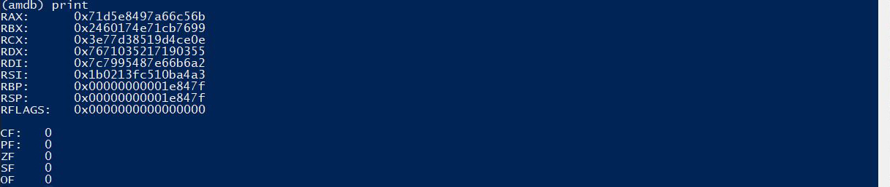
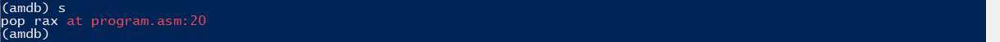

</img>

# AMx64
<p align="justify"><b>AMx64</b> was originally created for a <i>Computer Architecture</i> course project, as taught at the Faculty of Electrical Engineering Banja Luka. The project has been since expanded and updated. The motivation behind this project was a better understanding of NASM and assembly language.</p>

## Table of contents
- [AMx64](#amx64)
  - [Table of contents](#table-of-contents)
  - [Introduction](#introduction)
  - [Usage](#usage)
  - [CPU details](#cpu-details)
  - [The AMASM Language (AMx64 Assembly Language)](#the-amasm-language-amx64-assembly-language)
    - [Sections](#sections)
      - [Data Section (.data)](#data-section-data)
      - [BSS Section (.bss)](#bss-section-bss)
      - [Text Section (.text)](#text-section-text)
    - [Layout of a AMASM Source Line](#layout-of-a-amasm-source-line)
    - [Pseudo-Instructions](#pseudo-instructions)
      - [DB and Friends: Declaring Initialized Data](#db-and-friends-declaring-initialized-data)
      - [RESB and Friends: Declaring Uninitialized Data](#resb-and-friends-declaring-uninitialized-data)
    - [Numeric Constants](#numeric-constants)
    - [Character Strings](#character-strings)
    - [Character Constants](#character-constants)
    - [String Constants](#string-constants)
    - [Comments](#comments)
    - [Labels](#labels)
    - [Operand/Address Size (Data Storage Sizes)](#operandaddress-size-data-storage-sizes)
    - [Supported instructions](#supported-instructions)
      - [ADD - Add](#add---add)
      - [SUB - Subtract](#sub---subtract)
      - [AND - Bitwise AND](#and---bitwise-and)
      - [OR - Bitwise OR](#or---bitwise-or)
      - [NOT - Bitwise NOT](#not---bitwise-not)
      - [MOV - Move](#mov---move)
      - [CMP - Compare](#cmp---compare)
      - [JMP - Unconditional Jump](#jmp---unconditional-jump)
      - [Jcc - Jump if Condition Is Met (Conditional Jump)](#jcc---jump-if-condition-is-met-conditional-jump)
      - [PUSH](#push)
      - [POP](#pop)
  - [Memory](#memory)
    - [Stack](#stack)
    - [Registers](#registers)
      - [General-Purpose Registers (GPRs)](#general-purpose-registers-gprs)
      - [FLAGS register](#flags-register)
    - [Addressing modes for data](#addressing-modes-for-data)
      - [Register (direct) Addressing](#register-direct-addressing)
      - [Immediate (literal) Addressing](#immediate-literal-addressing)
      - [Direct Memory Addressing](#direct-memory-addressing)
      - [Register Indirect Addressing](#register-indirect-addressing)
  - [Calling System Services](#calling-system-services)
    - [Return Codes](#return-codes)
    - [Console Output](#console-output)
    - [Console Input](#console-input)
    - [Proper way to end asm code](#proper-way-to-end-asm-code)
  - [Debug - AMDB](#debug---amdb)
    - [Getting Help](#getting-help)
    - [Setting Breakpoints](#setting-breakpoints)
    - [Deleting Breakpoints](#deleting-breakpoints)
    - [Display Source Code](#display-source-code)
    - [Examine Memory (Display Memory/Register Contents)](#examine-memory-display-memoryregister-contents)
    - [Continuing and Stepping](#continuing-and-stepping)
    - [Quitting](#quitting)
  - [References](#references)
    - [Books](#books)
    - [Links](#links)
    - [Github projects](#github-projects)
  - [To-Do List](#to-do-list)


## Introduction
<p align="justify"><b>AMx64</b> is a simplified 64-bit processor simulator implemented in C#. It comes with a build-in, assembly language loosely based around <a href="https://www.nasm.us">NASM</a>. The processor acts as 64-bit machine code interpreter with its own instruction set that includes integer computations.</p>

## Usage
<p align="justify">To start the interpreter all you need to do is run the following command: </p>

```powershell
.\AMx64.exe program.asm
```

<p align="justify">You can use <code>--help</code> (abbreviated <code>-h</code>) with no arguments to display a short list of commands available in AMx64,
<p>

or you can run your program in debug mode by using a <code>--debug</code> or <code>-d</code> option.</p>

```powershell
.\AMx64.exe program.asm -d
```

## CPU details
<p align="justify">Registers are small storage cells built directly into a processor that are vastly faster than main memory (RAM) but are also more expensive per byte. Because of this price factor, there is not typically much room in a processor for storing data. The execution of a typical program is: move data from memory to registers, perform computations, move processed data from registers to memory and repeat.<br><br>
General-purpose registers are used for processing integral instructions (the most common type) and are under the complete control of the programmer.</p>

> **_NOTE:_**
> 
> If you modify a subdivision of a register, the other subdivisions of that register will see the change.

## The AMASM Language (AMx64 Assembly Language)
<p align="justify"><b>AMx64</b> comes with build-in assembly language loosely based around NASM or Intel syntax. Before we describe the syntax of operations and other utilities, we need to go over some of the basics of <b>AMx64</b> assembly language.</p>

### Sections
<p align="justify">In a typical assembly language, your program is broken up into several sections.</p>

> **_NOTE:_**
> 
> <ul><li><code>.data</code> and <code>.bss</code> sections must come before <code>.text</code> section in asm code.</li>
> <li><code>.rodata</code> section isn't supported.</li></ul>

#### Data Section (.data)
<p align="justify">The data section holds all variables that are initialized to specific values. This will typically be used only for global variables. The initialized data must be declared in the <code>section .data</code> section. There must be a space after the word <i>section</i>. All initialized variables and constants are placed in this section. Variable names must start with a letter, followed by letters or numbers, including a special character, underscore. Variable definitions must include the name, the data type, and the initial value for the variable.</p>

#### BSS Section (.bss)
<p align="justify">The BSS section (Block Started by Symbol) is a section that has no contents in terms of data or instructions. It consists only of a number that represents its length that the operating system then expands upon program initialization to a zero-filled, contiguous block of memory with said length (hence the name). This is used when you would ordinarily put something in the data section, but you don’t care about initializing it to a specific value. Uninitialized data must be declared in the <code>section .bss</code> section. There must be a space after the word <i>section</i>. All uninitialized variables are declared in this section. Variable names must start with a letter, followed by letters or numbers, including a special character, underscore. Variable definitions must include the name, the data type, and the count.</p>

#### Text Section (.text)
<p align="justify">The text section holds all of your executable code and will typically dwarf the other sections in terms of size. The code is placed in the <code>section .text</code> section. There must be a space after the word <i>section</i>. The instructions are specified one per line and each must be a valid instruction with the appropriate required operands. The text section will include some headers or labels that define the initial program entrypoint. The following declarations must be included.</p>

```asm
global main
main:
```

> **_NOTE:_**
> 
> <p align="justify">AMx64 require asm file to define the program entry point, where execution will begin when the program is run. In NASM you specify the entry point by declaring the special symbol ..start at the point where you wish execution to begin. In AMASM you can use user-defined entry point.</p>

### Layout of a AMASM Source Line
<p align="justify">Like most assemblers, each <b>AMASM</b> source line contains some combination of the four fields</p>

`label: instruction operands ; comment`

<p align="justify">As usual, most of these fields are optional; the presence or absence of any combination of a label, an instruction and a comment is allowed. Of course, the operand field is either required or forbidden by the presence and nature of the instruction field. It doesn't support multiline commands that are available in <b>NASM</b> using the backslash character (\) as the line continuation character.</p>

<p align="justify"><b>AMASM</b> places no restrictions on white space within a line: labels may have white space before them, or instructions may have no space before them, or anything. The colon after a label is also optional.</p>

### Pseudo-Instructions
<p align="justify">Pseudo-instructions are things which, though not real x86 machine instructions, are used in the instruction
field anyway because that’s the most convenient place to put them. The current pseudo-instructions are DB, DW, DD and DQ; their uninitialized counterparts RESB, RESW, RESD and RESQ.</p>

> **_NOTE:_**
>
> <ul><li>The INCBIN command, the EQU command, and the TIMES prefix are not currently available.</li>
> <li>Pseudo-instructions DT, DO, DY, REST, RESO and RESY are also not available.</li></ul>

#### DB and Friends: Declaring Initialized Data
<p align="justify">DB, DW, DD and DQ are used, much as in MASM, to declare initialized data in the output file. They can be invoked in a wide range of ways:</p>

```asm
  db 0x55 ; just the byte 0x55
  db 0x55,0x56,0x57 ; three bytes in succession
  db 'a',0x55 ; character constants are OK
  db 'hello',13,10,'$' ; so are string constants
  dw 0x1234 ; 0x34 0x12
  dw 'a' ; 0x61 0x00 (it’s just a number)
  dw 'ab' ; 0x61 0x62 (character constant)
  dw 'abc' ; 0x61 0x62 0x63 0x00 (string)
  dd 0x12345678 ; 0x78 0x56 0x34 0x12
  dq 0x123456789abcdef0 ; eight byte constant
```

#### RESB and Friends: Declaring Uninitialized Data
<p align="justify">RESB, RESW, RESD and RESQ are designed to be used in the BSS section of a module: they declare uninitialized storage space. Each takes a single operand, which is the number of bytes, words, doublewords or whatever to reserve. For example:</p>

```asm
  buffer resb 64 ; reserve 64 bytes
  wordvar resw 1 ; reserve a word
```

### Numeric Constants
<p align="justify">A numeric constant is simply a number. Number values may be specified in decimal, hex, or octal. <b>AMASM</b> allows you to specify numbers in a variety of number bases, in a variety of ways: you can suffix <i>H</i> or <i>X</i>, <i>D</i> or <i>T</i>, <i>Q</i> or <i>O</i>, and <i>B</i> or </i>Y</i> for hexadecimal, decimal, octal and binary respectively, or you can prefix <i>0x</i>, for hexadecimal in the style of C. In addition, AMASM accept the prefix <i>0h</i> for hexadecimal, <i>0d</i> or <i>0t</i> for decimal, <i>0o</i> or <i>0q</i> for octal, and <i>0b</i> or <i>0y</i> for binary. Please note that unlike C, a <i>0</i> prefix by itself does not imply an octal constant!</p>

Some examples (all producing exactly the same code):
 ```asm
  mov ax,200 ; decimal
  mov ax,0200 ; still decimal
  mov ax,0200d ; explicitly decimal
  mov ax,0d200 ; also decimal
  mov ax,0c8h ; hex
  mov ax,0xc8 ; hex yet again
  mov ax,0hc8 ; still hex
  mov ax,310q ; octal
  mov ax,310o ; octal again
  mov ax,0o310 ; octal yet again
  mov ax,0q310 ; hex yet again
  mov ax,11001000b ; binary
  mov ax,1100_1000b ; same binary constant
  mov ax,0b1100_1000 ; same binary constant yet again
```
> **_NOTE:_**
>
> Numeric constants can have underscores ('_') interspersed to break up long strings.
> 

### Character Strings
<p align="justify">In addition to numeric data, symbolic (non-numeric) data is often required. Consequently, the symbols are represented by assigning numeric values to each symbol or character. A character is typically stored in a byte (8-bits) of space. This works well since memory is byte addressable. Examples of characters include letters, numerical digits, common punctuation marks (such as '.' or '!'), and whitespace.<br>A character string consists of up to eight characters enclosed in either single quotes ('...'), double quotes ("...") or backquotes (`...`). Single or double quotes are equivalent to NASM (except of course that surrounding the constant with single quotes allows double quotes to appear within it and vice versa); the contents of those are represented verbatim. The general concept also includes control characters, which do not correspond to symbols in a particular language, but to other information used to process text. Examples of control characters include carriage return or tab.

Strings enclosed in backquotes support C−style \–escapes for
special characters. The following escape sequences are recognized by backquoted strings: </p>

<table>
  <tr>
    <td>\’</td>
    <td>single quote (’)</td>
  </tr>
  <tr>
    <td>\"</td>
    <td>double quote (")</td>
  </tr>
  <tr>
    <td>\‘</td>
    <td>backquote (`)</td>
  </tr>
  <tr>
    <td>\\</td>
    <td>backslash (\)</td>
  </tr>
  <tr>
    <td>\?</td>
    <td>question mark (?)</td>
  </tr>
  <tr>
    <td>\a</td>
    <td>BEL (ASCII 7)</td>
  </tr>
  <tr>
    <td>\b</td>
    <td>BS (ASCII 8)</td>
  </tr>
  <tr>
    <td>\t</td>
    <td>TAB (ASCII 9)</td>
  </tr>
  <tr>
    <td>\n</td>
    <td>LF (ASCII 10)</td>
  </tr>
  <tr>
    <td>\v</td>
    <td>VT (ASCII 11)</td>
  </tr>
  <tr>
    <td>\f</td>
    <td>FF (ASCII 12)</td>
  </tr>
  <tr>
    <td>\r</td>
    <td>CR (ASCII 13)</td>
  </tr>
  <tr>
    <td>\e</td>
    <td>ESC (ASCII 27)</td>
  </tr>
  <tr>
    <td>\377</td>
    <td>Up to 3 octal digits − literal byte</td>
  </tr>
  <tr>
    <td>\xFF</td>
    <td>Up to 2 hexadecimal digits − literal byte</td>
  </tr>
</table>
<br>

> **_NOTE:_**
> 
> <ul><li><p align="justify">Character literals don't currently support quotes '<code>"</code>'.</p></li>
> <li><p align="justify">Unicode character escapes are not yet supported.</li</p>
> <li><p align="justify">Characters can be displayed to the console, but cannot be used for calculations. Integers can be used for calculations, but cannot be displayed to the console (without changing the representation).</p></li></ul>

### Character Constants
 <p align="justify">A character constant consists of a string up to eight bytes long, used in an expression context. It is treated as if
it was an integer. A character constant with more than one byte will be arranged with little−endian order in mind: if you code</p>

```asm
mov eax,'abcd'
```

<p align="justify">then the constant generated is not 0x61626364, but 0x64636261, so that if you were then to store the value into memory, it would read abcd rather than dcba.</p>

### String Constants
<p align="justify">String constants are character strings used in the context of some pseudo−instructions, namely the DB family. A string constant looks like a character constant, only longer. It is treated as a concatenation of maximum−size character constants for the conditions. So the following are equivalent:</p>

```asm
db 'hello' ; string constant
db 'h','e','l','l','o'   ; equivalent character constants
```

> **_NOTE:_**
>
> When used in a string−supporting context, quoted strings are treated as a string constants even if they are short enough to be a character constant, because otherwise db ’ab’ would have the same effect as db ’a’, which would be silly.

### Comments
<p align="justify">The semicolon (';') is used to note program comments. Comments (using the ';') may be placed anywhere, including after an instruction. Any characters after the ';' are ignoredby the interpreter. This can be used to explain steps taken in the code or to comment out sections of code.</p>

### Labels
<p align="justify">A program label is the target, or a location to jump to, for control statements. For example, the start of a loop might be marked with a label such as “<i>loopStart</i>”. The code may be re-executed by jumping to the label. Generally, a label starts with a letter, followed by letters, numbers, or symbols (limited to '_'), terminated with a colon (':').</p>

> **_NOTE:_**
> 
> <ul><li>Local labels aren't available.</li>
> <li>Program labels may be defined only once.</li></ul>

### Operand/Address Size (Data Storage Sizes)
 <p align="justify">The x86-64 architecture supports a specific set of data storage size elements, all based on powers of two. To specify a size of operand, simply preface the operands or operand with mnemonic for the size you want. In situation when you have for instance <code>add qword rax, rbx</code>, size is perfectly valid but redundant. These sizes are not case sensitive. You should already be quite aware that addresses can have different sizes. Almost any instruction that references memory must use one of the prefixes BYTE, WORD, DWORD or QWORD to indicate what size of memory operand it refers to (e.q. <code>add byte rax, [rbx]</code>). The supported storage sizes are as follows:</p>
 <table>
  <tr>
    <th>Storage</th>
    <th>Size<br>(bits)</th>
    <th>Size<br>(bytes)</th>
  </tr>
  <tr>
    <td>BYTE</td>
    <td>8-bits</td>
    <td>1 byte</td>
  </tr>
  <tr>
    <td>WORD</td>
    <td>16-bits</td>
    <td>2 byte</td>
  </tr>
  <tr>
    <td>DWORD<br>(Double-word)</td>
    <td>32-bits</td>
    <td>4 byte</td>
  </tr>
  <tr>
    <td>QWORD<br>(Quadword)</td>
    <td>64-bits</td>
    <td>8 byte</td>
  </tr>
</table>
 
### Supported instructions
<p align="justify">This chapter provides a basic overview for a simple subset of the x86-64 instruction setfocusing on the integer operation. This section summarizes the notation used is fairly common in the technical literature. In general, an instruction will consist of the instruction or operation itself (e.q., add, sub, etc.) and the operands. The operands refer to where the data (to be operated on) is coming from and/or where the result is to be placed.</p>

> **_NOTE:_**
>
> Instructions, register and variable names are case-insensitive.

#### ADD - Add
<p align="justify">Adds the destination operand (first operand) and the source operand (second operand) and then stores the result in the destination operand. The destination operand can be a register or a memory location; the source operand can be an immediate, a register, or a memory location. (However, two memory operands cannot be used in one instruction.) When an immediate value is used as an operand, it is sign-extended to the length of the destination operand format.</p>

Usage:
```asm
ADD r, imm/r/m
ADD m, imm/r
```

Format:

```asm
DEST ← DEST + SRC;
```

Flags affected:
1. **ZF** is set if the result is zero; it's cleared otherwise.
2. **SF** is set if the result is negative; it's cleared otherwise.
3. **PF** is set if the result has even parity in the low 8 bits; it's cleared otherwise.
4. **CF** is set if the addition caused a carry out from the high bit; it's cleared otherwise.
5. **OF** is set if the addition resulted in arithmetic under/overflow; it's cleared otherwise.

> **_NOTE:_**
>
> The ADD instruction performs integer addition. 

#### SUB - Subtract
<p align="justify">Subtracts the second operand (source operand) from the first operand (destination operand) and stores the result in the destination operand. The destination operand can be a register or a memory location; the source operand can be an immediate, register, or memory location. (However, two memory operands cannot be used in one instruction.) When an immediate value is used as an operand, it is sign-extended to the length of the destination operand format.</p>


Usage:
```asm
SUB r, imm/r/m
SUB m, imm/r
```

Format:

```asm
DEST ← (DEST – SRC);
```

Flags affected:
1. **ZF** is set if the result is zero; it's cleared otherwise.
2. **SF** is set if the result is negative; it's cleared otherwise.
3. **PF** is set if the result has even parity in the low 8 bits; it's cleared otherwise.
4. **CF** is set if the subtraction caused a borrow from the low 4 bits; it's cleared otherwise.
5. **OF** is set if the subtraction resulted in arithmetic under/overflow; it's cleared otherwise.

> **_NOTE:_**
>
> The SUB instruction performs integer subtraction.
> 
#### AND - Bitwise AND
<p align="justify">Performs a bitwise AND operation on the destination (first) and source (second) operands and stores the result in the destination operand location. The source operand can be an immediate, a register, or a memory location; the destination operand can be a register or a memory location. (However, two memory operands cannot be used in one instruction.) Each bit of the result is set to 1 if both corresponding bits of the first and second operands are 1; otherwise, it is set to 0.</p>

Usage:
```asm
AND r, imm/r/m
AND m, imm/r
```

Format:

```asm
DEST ← DEST AND SRC;
```

Flags affected:
1. **ZF** is set if the result is zero; it's cleared otherwise.
2. **SF** is set if the result is negative; it's cleared otherwise.
3. **PF** is set if the result has even parity in the low 8 bits; it's cleared. otherwise.
4. **CF** and **OF** are cleared.

#### OR - Bitwise OR
<p align="justify">Performs a bitwise inclusive OR operation between the destination (first) and source (second) operands and stores the result in the destination operand location. The source operand can be an immediate, a register, or a memory location; the destination operand can be a register or a memory location. (However, two memory operands cannot be used in one instruction.) Each bit of the result of the OR instruction is set to 0 if both corresponding bits of the first and second operands are 0; otherwise, each bit is set to 1.</p>

Usage:

```asm
OR r, imm/r/m
OR m, imm/r
```

Format:

```asm
DEST ← DEST OR SRC;
```

Flags affected:
1. **ZF** is set if the result is zero; it's cleared otherwise.
2. **SF** is set if the result is negative; it's cleared otherwise.
3. **PF** is set if the result has even parity in the low 8 bits; it's cleared
4. **CF** and **OF** are cleared.

#### NOT - Bitwise NOT
<p align="justify">Performs a bitwise NOT operation (each 1 is set to 0, and each 0 is set to 1) on the destination operand and stores the result in the destination operand location. The destination operand can be a register or a memory location.</p>

Usage:
```asm
NOT r/m
```

Format:

```asm
DEST ← NOT DEST;
```

> **_NOTE:_**
> 
>  It doesn't affect flags.

#### MOV - Move
<p align="justify">Copies the second operand (source operand) to the first operand (destination operand). The source operand can be an immediate value, general-purpose register or memory location; the destination register can be a general-purpose register or memory location. Both operands must be the same size, which can be a byte, a word, a doubleword, or a quadword.</p>

Usage:

```asm
MOV r, imm/r/m
MOV m, imm/r
```

> **_NOTE:_**
> 
>  It doesn't affect flags.

#### CMP - Compare
<p align="justify">Compares the first source operand with the second source operand and sets the status flags in the EFLAGS register according to the results. The comparison is performed by subtracting the second operand from the first operand and then setting the status flags in the same manner as the SUB instruction. When an immediate value is used as an operand, it is sign-extended to the length of the first operand. SUB should be used in place of CMP when the result is needed. The condition codes used by the Jcc instructions are based on the results of a CMP instruction. 

Usage:

```asm
CMP r, imm/r/m
CMP m, imm/r
```

Format:

```asm
temp ← SRC1 − SignExtend(SRC2);
ModifyStatusFlags;
```

Flags affected:
1. **ZF** is set if the result is zero; it's cleared otherwise.
2. **SF** is set if the result is negative; it's cleared otherwise.
3. **PF** is set if the result has even parity in the low 8 bits; it's cleared otherwise.
4. **CF** is set if the subtraction caused a borrow from the low 4 bits; it's cleared otherwise.
5. **OF** is set if the subtraction resulted in arithmetic under/overflow; it's cleared otherwise.

#### JMP - Unconditional Jump
<p align="justify">Jumps execution to the provided location in a program denoted with a program label. This instruction does not depend on the current conditions of the flag bits in the EFLAG register. Transfer of control may be forward, to execute a new set of instructions or backward, to re-execute the same steps.</p>
Usage:

```asm
JMP label
```

> **_NOTE:_**
> 
>  It doesn't affect flags.

#### Jcc - Jump if Condition Is Met (Conditional Jump)
<p align="justify">Jcc is not a single instruction, it describes the jump mnemonics that checks the condition code before jumping. If some specified condition is satisfied in conditional jump, the control flow is transferred to a target instruction. These instructions form the basis for all conditional branching. There are numerous conditional jump instructions depending upon the condition and data.<br>

Two steps are required for a Jcc; the compare instruction and the conditional jump instruction. The conditional jump instruction will jump or not jump to the provided label based on the result of the previous comparison operation. The compare instruction will compare two operands and store the results of the comparison in the EFLAG register. This requires that the compare instruction is immediately followed by the conditional jump instruction. If other instructions are placed between the compare and conditional jump, the EFLAG register will be altered and the conditional jump may not reflect the correct condition.</p>
Usage:

```asm
Jcc label
```

Intruction | Description | Flags tested | Condition
| - | - | :-: | :-:
JE | Jump Equal | ZF | ZF == 1
JNE | Jump not Equal | ZF | ZF == 0
JGE | Jump Greater/Equal | OF, SF | SF == 0
JL | Jump Less | OF, SF | SF != 0

> **_NOTE:_**
> 
>  It doesn't affect flags.

#### PUSH
<p align="justify">Decrements the stack pointer and then stores the source operand on the top of the stack. The size parameter determines the size of the value that is pushed.</p>
Usage:

```asm
PUSH imm/r/m
```

> **_NOTE:_**
> 
> <ul><li>It doesn't affect flags.</li>
> <li>The operand size (16, 32, or 64 bits) determines the amount by which the stack pointer is decremented (2, 4 or 8).</li>
> <li>If the source operand is an immediate of size less than the operand size, a sign-extended value is pushed on the stack.</li></ul>

#### POP
<p align="justify">Loads the value from the top of the stack to the location specified with the destination operand (or explicit opcode) and then increments the stack pointer. The destination operand can be a general-purpose register, memory location, or segment register.</p>
Usage:

```asm
POP r/m
```

Format:

```asm
pop value;
dest ← value;
```

> **_NOTE:_**
> 
> <ul><li>It doesn't affect flags.</li>
> <li>The operand size (16, 32, or 64 bits) determines the amount by which the stack pointer is incremented (2, 4 or 8).</li></ul>

## Memory
<p align="justify">A memory value is an expression that evaluates to the address of some value in memory. In <b>AMx64</b> assembly language, addresses are enclosed in brackets “[…]” with the address expression inside.</p>

> **_NOTE:_**
> 
>  Despite the fact that you can use 64-bit address, you only have 2 GB of memory available due to internal limits of C# in Visual Studio.

### Stack
<p align="justify">In a computer, a stack is a type of data structure where items are added and then removed from the stack in reverse order. That is, the most recently added item is the very first one that is removed. This is often referred to as Last-In, First-Out (LIFO). A stack is heavily used in programming for the storage of information during procedure or function calls.

In most languages (even low-level ones) the stack is completely hidden from the programmer. In these languages we can only indirectly impact it. We already know that declaring a variable sets aside space on the stack, and that calling a function uses the stack as well. The difference now is that in assembly language, the programmer is responsible for managing the stack.

The stack is managed by RBP and RSP (base pointer and stack pointer). Upon program initialization, RBP and RSP are set to the address of the top of the stack, which begins at the high side of the program's available memory and grows downward. Because of this, RSP will always point to the most-recently-added item on the stack. To add an item to the stack you can use the PUSH instruction. To remove an item, you can use the POP instruction.</p>

> **_NOTE:_**
> <ul><li>You can't push 8 bit value on stack.</li>
> <li>RSP can modified directly without damaging the stack structure, but care should be taken when doing so.</li></ul>

### Registers
<p align="justify">Register operand refers to the contents of a register. <b>AMx64</b> has a total of 16 registers, but not all of the currently in use. To refer to one of the avaliable registers, you simply need to designate the name of the partition you want to use (e.q. RAX, RBX, etc.). The register name you use indicates the size of the operand (i.e. how much data is moved, processed, etc.). For instance, using EAX to load a value from memory (e.g. <code>mov eax, [var]</code>) loads a 32-bit value from memory into the 32-bit partition of RAX.

<b>AMx64</b> uses the following names for general-purpose registers in 64-bit mode. This is consistent with the AMD/Intel documentation and most other assemblers.</p>

#### General-Purpose Registers (GPRs)
<p align="justify">There are sixteen, 64-bit General Purpose Registers (GPRs). The currently available GPRs are described in the following table. A GPR register can be accessed with all 64-bits or some portion or subset accessed.</p>
<table style="width:80%">
  <tr>
    <th>Naming conventions</th>
    <th>64 bits</th>
    <th>32 bits</th>
    <th>16 bits</th>
    <th>High 8 bits</th>
    <th>Low 8 bits</th>
  </tr>
  <tr>
    <td>Accumulator</td>
    <td>RAX</td>
    <td>EAX</td>
    <td>AX</td>
    <td>AH</td>
    <td>AL</td>
  </tr>
  <tr>
    <td>Base</td>
    <td>RBX</td>
    <td>EBX</td>
    <td>BX</td>
    <td>BH</td>
    <td>BL</td>
  </tr>
  <tr>
    <td>Counter</td>
    <td>RCX</td>
    <td>ECX</td>
    <td>CX</td>
    <td>CH</td>
    <td>CL</td>
  </tr>
  <tr>
    <td>Data</td>
    <td>RDX</td>
    <td>EDX</td>
    <td>DX</td>
    <td>DH</td>
    <td>DL</td>
  </tr>
  <tr>
    <td>Stack pointer</td>
    <td>RSP</td>
    <td>ESP</td>
    <td>SP</td>
    <td colspan="2"></td>
  </tr>
  <tr>
    <td>Stack base pointer</td>
    <td>RBP</td>
    <td>EBP</td>
    <td>BP</td>
    <td colspan="2"></td>
  </tr>
  <tr>
    <td>Source index</td>
    <td>RSI</td>
    <td>ESI</td>
    <td>SI</td>
    <td colspan="2"></td>
  </tr>
  <tr>
    <td>Destination index</td>
    <td>RDI</td>
    <td>EDI</td>
    <td>DI</td>
    <td colspan="2"></td>
  </tr>
</table>
<p align="justify">When using data element sizes less than 64-bits (e.q. 32-bit, 16-bit, or 8-bit), the lower portion of the register can be accessed by using a different register name as shown in the table.</p>

> **_NOTE:_**
> 
>  Some of the GPR registers are used for dedicated purposes as described inthe later sections. 
#### FLAGS register
<p align="justify">Status register contains the current state of processor. This register stores status information about the instruction that was justexecuted. It's 16 bits wide. Its successors, the EFLAGS and RFLAGS registers, are 32 bits and 64 bits wide, respectively. The wider registers retain compatibility with their smaller predecessors, as it is the case with the other registers. <b>AMx64</b> flags register conforms to Intel x86_64 standard; not all bits are used in the current version.</p>

<table style="width:100%">
  <tr>
    <th>Bit</th>
    <th>Mark</th>
    <th>Abbreviation</th>
    <th>Name</th>
    <th colspan="2"><p align="center">Description</p></th>
    <th>=1</th>
    <th>=0</th>
    <th>Implementation status</th>
  </tr>
  <tr>
    <td style="text-align:center">0</td>
    <td style="text-align:center">0x0001</td>
    <td><p align="center">CF</p></td>
    <td>Carry flag</td>
    <td colspan="2"><p align="justify">Set if the last arithmetic operation carried (addition) or borrowed (subtraction) a bit beyond the size of the register. This is then checked when the operation is followed with an add-with-carry or subtract-with-borrow to deal with values too large for just one register to contain.</p></td>
    <td>CY (Carry)</td>
    <td>NC (No Carry)</td>
    <td><p align="center">✅</p></td>
  </tr>
  <tr>
    <td style="text-align:center">2</td>
    <td style="text-align:center">0x0004</td>
    <td><p align="center">PF</p></td>
    <td>Adjust flag</td>
    <td colspan="2"><p align="justify">Carry of Binary Code Decimal (BCD) numbers arithmetic operations.</p></td>
    <td>AC (Auxiliary Carry)</td>
    <td>NA (No Auxiliary Carry)</td>
    <td><p align="center">✅</p></td>
  </tr>
  <tr>
    <td style="text-align:center">4</td>
    <td style="text-align:center">0x0010</td>
    <td><p align="center">AF</p></td>
    <td>Parity flag</td>
    <td colspan="2"><p align="justify">Set if the number of set bits in the least significant byte is a multiple of 2.</p></td>
    <td>PE (Parity Even)</td>
    <td>PO (Parity Odd)</td>
    <td><p align="center">❎</p></td>
  </tr>
  <tr>
    <td style="text-align:center">6</td>
    <td style="text-align:center">0x0040</td>
    <td><p align="center">ZF</p></td>
    <td>Zero flag</td>
    <td colspan="2"><p align="justify">Set if the result of an operation is Zero (0).</p></td>
    <td>ZR (Zero)</td>
    <td>NZ (Not Zero)</td>
    <td><p align="center">✅</p></td>
  </tr>
  <tr>
    <td style="text-align:center">7</td>
    <td style="text-align:center">0x0080</td>
    <td><p align="center">SF</p></td>
    <td>Sign flag</td>
    <td colspan="2"><p align="justify">Set if the result of an operation is negative.</p></td>
    <td>NG (Negative)</td>
    <td>PL (Positive)</td>
    <td><p align="center">✅</p></td>
  </tr>
  <tr>
    <td style="text-align:center">8</td>
    <td style="text-align:center">0x0100</td>
    <td><p align="center">TF</p></td>
    <td>Trap flag</td>
    <td colspan="2"><p align="justify">Set if step by step debugging.</p></td>
    <td colspan="2"></td>
    <td><p align="center">❎</p></td>
  </tr>
  <tr>
    <td style="text-align:center">9</td>
    <td style="text-align:center">0x0200</td>
    <td><p align="center">IF</p></td>
    <td>Interrupt enable flag</td>
    <td colspan="2"><p align="justify">Set if interrupts are enabled.</p></td>
    <td>EI (Enable Interrupt)</td>
    <td>DI (Disable Interrupt)</td>
    <td><p align="center">❎</p></td>
  </tr>
  <tr>
    <td style="text-align:center">10</td>
    <td style="text-align:center">0x0400</td>
    <td><p align="center">DF</p></td>
    <td>Direction flag</td>
    <td colspan="2"><p align="justify">Stream direction. If set, string operations will decrement their pointer rather than incrementing it, reading memory backwards.</p></td>
    <td>DN (Down)</td>
    <td>UP (Up)</td>
    <td><p align="center">❎</p></td>
  </tr>
  <tr>
    <td style="text-align:center">11</td>
    <td style="text-align:center">0x0800</td>
    <td><p align="center">OF</p></td>
    <td>Overflow flag</td>
    <td colspan="2"><p align="justify">Set if signed arithmetic operations result in a value too large for the register to contain.</p></td>
    <td>OV (Overflow)</td>
    <td>NV (Not Overflow)</td>
    <td><p align="center">❎</p></td>
  </tr>
  <tr>
    <td style="text-align:center">12-13</td>
    <td style="text-align:center">0x3000</td>
    <td><p align="center">IOPL</p></td>
    <td>I/O privilege level</td>
    <td colspan="2"><p align="justify">I/O Privilege Level of the current process.</p></td>
    <td colspan="2"></td>
    <td><p align="center">❎</p></td>
  </tr>
</table>

### Addressing modes for data
<p align="justify">The addressing mode indicates the manner in which the operand is presented or the addressing modes are the supported methods for accessing a value in memory usingthe address of a data item being accessed (read or written). This might include the nameof a variable or the location in an array.<p>

> **_NOTE:_**
> 
> The only way to access memory is with the brackets ("[]"). Omitting the brackets will not access memory and instead obtain the address of the item.

#### Register (direct) Addressing
```
+------+-----+-----+
| mov  | reg1| reg2| reg1:=reg2
+------+-----+-----+
```
<p align="justify">This "addressing mode" does not have an effective address and is not considered to be an addressing mode on some computers. In this example, all the operands are in registers, and the result is placed in a register. E.q.<p>

```asm
mov ax, bx  ; moves contents of register bx into ax
```

#### Immediate (literal) Addressing
```
+------+-----+----------------+
| add  | reg1|    constant    |    reg1 := reg1 + constant;
+------+-----+----------------+
```
<p align="justify">This "addressing mode" does not have an effective address, and is not considered to be an addressing mode on some computers. E.q.<p>

```asm
mov ax, 1 ; moves value of 1 into register ax
```
<p align="justify">moves value of 1 into register ax. Instead of using an operand from memory, the value of the operand is held within the instruction itself.</p>

#### Direct Memory Addressing
<p align="justify">Direct memory mode addressing means that the operand is a location in memory (accessed via an address). This is also referred to as indirection or dereferencing.</p>

```asm
mov qword rax, [var] ; copy var content into rax
```
<p align="justify">This instruction will access the memory location of the variable <i>var</i> and retrieve the value stored there. This requires that the CPU wait until the value is retrieved before completing the operation and thus might take slightly longer to complete than a similar operation using an immediate value.</p>

> **_NOTE:_**
> 
>  Direct offset addressing is not currently supported.
> 
#### Register Indirect Addressing
<p align="justify">For example, when accessing arrays, a more generalized method is usually required. Specifically, an address can be placed in a register and indirection performed using the register (instead of the variable name). E.q.</p>

```asm
mov rbx, var
mov dword eax, [rbx]
```

## Calling System Services
<p align="justify">When calling system services, arguments are placed in the standard argument registers. System services do not typically use stack-based arguments. This limits the arguments of a system services to six. To call a system service, the first step is to determine which system service is desired. The general process is that the system service call code is placed in the RAX register. The call code is a number that has been assigned for the specific system service being requested. These are assigned as part of the operating system and cannot be changed by application programs.  <b>AMx64</b> uses a very small subset of system service call codes to a set of constants. If any are needed, the arguments for system services are placed in the RDI, RSI, RDX, RCX, R8 and R9 registers (in that order). The following table shows the argument locations which are consistent with the standard calling convention.</p>

<table style="width:30%">
  <tr>
    <th><p align="center">Register</p></th>
    <th><p align="left">Usage</p></th>
  </tr>
  <tr>
    <td><p align="center">RAX</p></td>
    <td><p align="left">Call code</p></td>
  </tr>
  <tr>
    <td><p align="center">RDI</p></td>
    <td><p align="left">1st argument</p></td>
  </tr>
  <tr>
    <td><p align="center">RSI</p></td>
    <td><p align="left">2nd argument</p></td>
  </tr>
  <tr>
    <td><p align="center">RDX</p></td>
    <td><p align="left">3rd argument</p></td>
  </tr>
  <tr>
    <td><p align="center">RCX</p></td>
    <td><p align="left">4th argument</p></td>
  </tr>
  <tr>
    <td><p align="center">R8</p></td>
    <td><p align="left">5th argument</p></td>
  </tr>
  <tr>
    <td><p align="center">R9</p></td>
    <td><p align="left">6th argument</p></td>
  </tr>
</table>

<p align="justify">Each system call will use a different number of arguments (from none up to 6). However, the system service call code is always required. After the call code and any arguments are set, the syscall instruction is executed. The syscall instruction will pause the interpret process and will attempt to perform the service specified in the RAX register. When the system service returns, the interpret process will be resumed.</p>

> **_NOTE:_**
> 
>  R8 and R9 registers are not currently available for usage.

### Return Codes
<p align="justify">The system call will return a code in the RAX register. If the value returned is less than 0, that is an indication that an error has occurred. If the operation is successful, the value returned will depend on the specific system service.</p>

<table style="width:100%">
  <tr>
    <th>Call Code (RAX)</th>
    <th>System Service</th>
    <th>Description</th>
  </tr>
  <tr>
    <td><p align="center">0</p></td>
    <td><p align="center">sys_read</p></td>
    <td><p align="justify">Read characters - If unsuccessful, returns negative value. If successful, returns count of characters actually read.<br>RDI - file descriptor<br>RSI - address of where to store characters<br>RDX - number of characters to read</p></td>
  </tr>
  <tr>
    <td><p align="center">1</p></td>
    <td><p align="center">sys_write</p></td>
    <td><p align="justify">Write characters - If unsuccessful, returns negative value. If successful, returns count of characters actually written.<br>RDI - file descriptor<br>RSI - address of characters  where to write<br>RDX - number of characters to write</p></td>
  </tr>
  <tr>
    <td><p align="center">60</p></td>
    <td><p align="center">sys_exit</p></td>
    <td><p align="justify">Terminate executing process.<br>RDI - exit status</p></td>
  </tr>
</table>

### Console Output
<p align="justify">The system service to output characters to the console is the system write (sys_write). Like a high-level language characters are written to standard out (stdout) which is the console.   The stdout is the default file descriptor for the console. The file descriptor is already opened and available for use in programs (assembly and high-level languages). The arguments for the write system service are as follows:</p>

<table style="width:40%">
  <tr>
    <th style="text-align:center">Register</th>
    <th>sys_write</th>
  </tr>
  <tr>
    <td style="text-align:center">RAX</td>
    <td style="text-align:left">Call code = sys_write (1)</td>
  </tr>
  <tr>
    <td style="text-align:center">RDI</td>
    <td style="text-align:left">Output location, stdout (1)</td>
  </tr>
  <tr>
    <td style="text-align:center">RSI</td>
    <td style="text-align:left">Address of characters to output</td>
  </tr>
  <tr>
    <td style="text-align:center">RDX</td>
    <td style="text-align:left">Number of characters to output</td>
  </tr>
</table>

### Console Input
<p align="justify">The system service to read characters from the console is the system read (sys_read). Like a high-level language, for the console, characters are read from standard input (stdin). The stdin is the default file descriptor for reading characters from the keyboard. The file descriptor is already opened and available for use in program (assembly and high-level languages).

When using the system service to read from the keyboard, much like the write system service, the number of characters to read is required. Of course, we will need to declare an appropriate amount of space to store the characters being read. If we request 10 characters to read and the user types more than 10, the additional characters will be lost.</p>

<table style="width:40%">
  <tr>
    <th style="text-align:center">Register</th>
    <th>sys_read</th>
  </tr>
  <tr>
    <td style="text-align:center">RAX</td>
    <td style="text-align:left">Call code = sys_read (0)</td>
  </tr>
  <tr>
    <td style="text-align:center">RDI</td>
    <td style="text-align:left">Input location, stdin (0)</td>
  </tr>
  <tr>
    <td style="text-align:center">RSI</td>
    <td style="text-align:left">Address of where to store characters read</td>
  </tr>
  <tr>
    <td style="text-align:center">RDX</td>
    <td style="text-align:left">Number of characters to read</td>
  </tr>
</table>

### Proper way to end asm code
<p align="justify">No special label or directives are required to terminate the program. However, to terminate asm code properly you should do the following:</p>

```asm
mov rax, 60
mov rdi, 0
syscall
```
<p align="justify">These instructions indicate that the program ends correctly. If the program terminates unsuccessfully it should store value 1 inside of the RDI register.</p>

## Debug - AMDB
<p align="justify">A debugger allows the user to control execution of a program, examine variables and other memory. <b>AMDB</b> is loosely based on <a href="https://en.wikipedia.org/wiki/GNU_Debugger">GDB</a>. Once the debugger   is started, in order to effectively use the debugger, an initial breakpoint must be set. Once a breakpoint is set, the <code>run</code> (or <code>r</code>) command can be performed. The breakpoint is indicated with a red line number on the left and the current location is indicated with a green asm line (see example below).  Specifically, the green line points to the next instruction to be executed. That is, the green asm line has not yet been executed.</p>
<p></p>

### Getting Help
<p align="justify">You can always ask <i>amdb</i> itself for information on its commands, using the command <code>help</code>. You can use <code>help</code> (abbreviated <code>h</code>) with no arguments to display a short list of commands.</p>
<p></p>

### Setting Breakpoints
<p align="justify">Breakpoints are set with the <code>break</code> command (abbreviated <code>b</code>). This command tells <i>amdb</i> to pause interpretation of your program at some point to allow you to inspect the value of variables and other memory locations. It will pause interpretation just before the specified line number is interpreted.</p>
<dl>
  <dt><b>break [breakpoints]</b></dt>
  <dd><p align="justify">Set a breakpoint(s) at the given location(s) (line number(s)). The breakpoint will stop your program just before it executes any of the code in the specified location. E.q. <code>break 2 3 4</code>.</p></dd>
</dl>

<p align="justify">As needed, additional breakpoints can be set. However, the <code>run</code> command will re-start execution from the beginning and stop at the initial breakpoint.</p>

### Deleting Breakpoints
<p align="justify">It is often necessary to eliminate a breakpoint once it has done its job and you no longer want your interpretation to stop there. This is called deleting the breakpoint. A breakpoint that has been deleted no longer exists. You can delete breakpoints using the <code>d</code> (or <code>delete</code>) command.</p>
<dl>
  <dt><b>delete</b></dt>
  <dd>Deletes all available breakpoints.</dd>
  <dt><b>delete [breakpoints]</b></dt>
  <dd>Deletes all available breakpoints. E.q. <code>delete 2 3 4</code>.</dd>
</dl>

### Display Source Code
<p align="justify">You can display your source code inside <i>amdb</i> using the <code>l</code> (or <code>list</code>) command. <i>amdb</i> will print 7 lines of source code at a time, with a line number at the start of each line. Current line is always highlighted with a green color.</p>

### Examine Memory (Display Memory/Register Contents)
<p align="justify">Once you have paused a interpretation, you can use the <code>p</code> (or <code>print</code>) command to print the values of variables, specified memory locations or registers.</p>
<dl>
  <dt><b>print</b></dt>
  <dd>Shows internal state of all available registers as well as the values of flags inside of the FLAGS register.<p></p></dd>
  <dt><b>print register</b></dt>
  <dd>Shows value stored in a specified register. E.q. <code>print RAX</code>.</dd>
  <dt><b>print size variable</b></dt>
  <dd>Shows value stored in memory starting from the memory location which is referenced using a variable. E.q. <code>print word hello_msg</code>.</dd>
  <dt><b>print size memory_location</b></dt>
  <dd>Shows value stored in memory starting from the memory location.  E.q. <code>print word 0x000000000000000A</code>. Memory location can be set in a hex format (e.q. 0x000000000000007B) or in a decimal format (e.q. 123).</dd>
</dl>

### Continuing and Stepping
<p align="justify">Continuing means resuming file interpretation until your it completes normally. In contrast, stepping means executing just one more “step” of your interpreter, where “step” means one line of source code. When continuing, interpreter may stop even sooner, due to a breakpoint.</p>
<dl>
  <dt><b>continue</b> or <b>c</b></dt>
  <dd>Continues interpretation until the end of the file or unitil it reaches the next breakpoint.</dd>
  <dt><b>step</b> or <b>s</b></dt>
  <dd>Interprets the current and stops interpretation on the next line.<p></p></dd>
</dl>

### Quitting
<p align="justify">To quit from a <i>amdb</i> session, type <code>q</code> (short for quit) or <code>quit</code>. <i>amdb</i> will ask if you really want to quit. If you do, type <code>y</code> followed by the <code>Enter</code> key. This check may see a little unnecessary, but it helps prevent people quitting accidentally at that crucial moment in a lengthy debugging session.</p>
<p></p>

## References
### Books
<ul>
  <li><p align="justify"><a href="https://www.amazon.com/Hackers-Delight-Henry-S-Warren-ebook-dp-B009GMUMTM/dp/B009GMUMTM/">Henry S. Warren, Jr. - <i>Hacker’s Delight</i></p></a></li>
  <li><p align="justify"><a href="https://www.intel.com/content/dam/www/public/us/en/documents/manuals/64-ia-32-architectures-software-developer-instruction-set-reference-manual-325383.pdf">Intel® 64 and IA-32 Architectures, Software Developer’s Manual</p></a></li>
  <li><p align="justify"><a href="http://www.egr.unlv.edu/~ed/assembly64.pdf">Ed Jorgensen - <i>x86-64 Assembly Language Programming with Ubuntu</i></p></a></li>
  <li><p align="justify"><a href="https://www.amazon.com/Assembly-Language-Step-Step-Programming-ebook/dp/B004QWZXFA">Jeff Duntemann - <i>Assembly Language Step-by-Step: Programming with Linux</i></p></a></li>
  <li><p align="justify"><a href="https://www.amazon.com/Debugging-GDB-GNU-Source-Level-Debugger/dp/1882114884">Richard Stallman, Roland Pesch, Stan Shebs - <i>Debugging with gdb: The gnu Source-Level Debugger</i></p></a></li>
</ul>

### Links
<ul>
  <li><p align="justify"><a href="https://cs.baylor.edu/~donahoo/tools/gdb/tutorial.html">How to Debug Using GDB</a></p></li>
  <li><p align="justify"><a href="https://en.wikibooks.org/wiki/X86_Assembly/X86_Architecture">x86 Assembly/X86 Architecture</a></p></li>
  <li><p align="justify"><a href="http://home.myfairpoint.net/fbkotler/nasmdocr.html">Nasm Instruction Set Reference</a></p></li>
  <li><p align="justify"><a href="https://blog.rchapman.org/posts/Linux_System_Call_Table_for_x86_64/">Linux System call table for x86 64</a></p></li>
  <li><p align="justify"><a href="https://able.bio/kerrishotts/building-a-basic-interpreter-80s-style--79a9d703">Building a BASIC Interpreter, '80s style</a></p></li>
  <li><p align="justify"><a href="https://teaching.csse.uwa.edu.au/units/CITS2230/resources/gdb-intro.html">A Quickstart Guide to Debugging C Programs with gdb</a></p></li>
  <li><p align="justify"><a href="https://opensource.com/article/21/1/gnu-project-debugger">A hands-on tutorial for using the GNU Project Debugger</a></p></li>
</ul>

### Github projects
Some of the projects that helped me create my project.
- [NASM](https://github.com/netwide-assembler/nasm)
- [CSX64](https://github.com/dragazo/CSX64)
- [Asm-Dude](https://github.com/HJLebbink/asm-dude)
- [binutils-gdb](https://github.com/bminor/binutils-gdb)

## To-Do List
- [x] Add Direct memory addressing.
- [ ] Add Direct offset addressing.
- [x] Add Register indirect addressing.
- [x] Implement Stack memory structure.
  - [x] Implement push and pop instructions.
- [x] Implement 64-bit addressable memory.
- [x] Implement assembler sections (.data, .bss, .text).
- [x] Implement C-style character escapes.
- [x] Implement character constants.
- [ ] Add pseudo-instruction EQU.
- [ ] Build an amdbui
